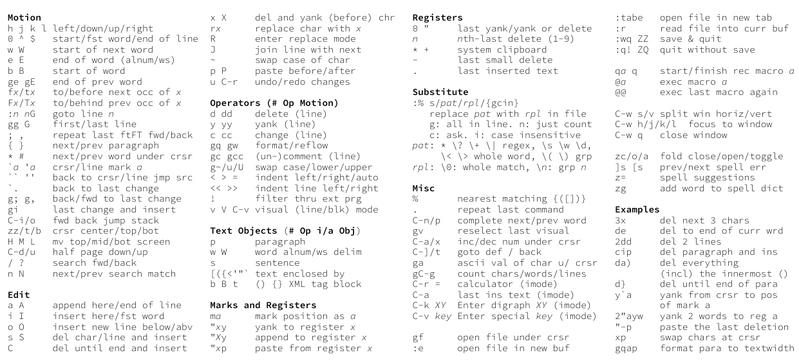

# Vim Cheat Mug

A vim cheat sheet to be put on a mug (for example [this one](https://tassendruck.de/Panoramatasse-Klassik-weiss-spuelmaschinenfest)) in the format of 210x96 mm.
Requires XeLaTeX and [Source Code Pro](https://ctan.org/tex-archive/fonts/sourcecodepro?lang=en).

Here is the current cheat sheet:

And a mug that I ordered with an older version of the cheat sheet.

